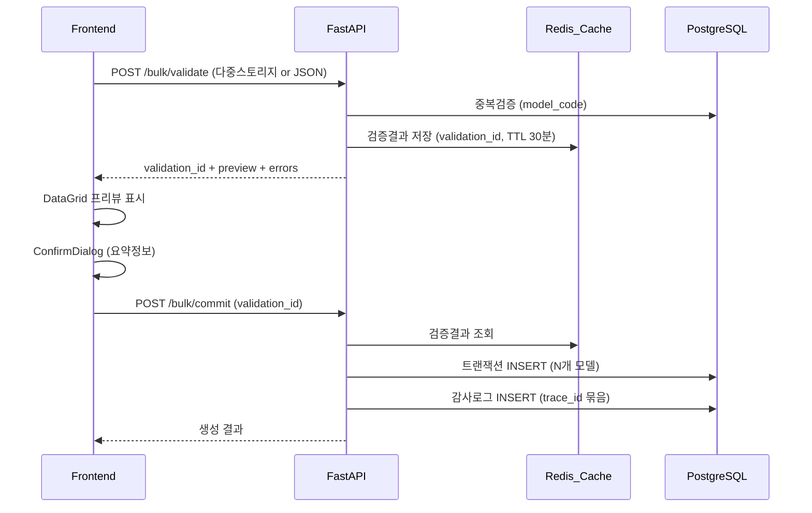
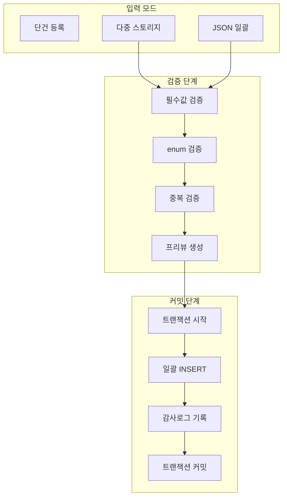

# SSOT 모델 일괄 등록 기능 고도화

## 현재 상태 분석

- **현재 구현**: 단건 등록만 가능 ([`frontend/src/app/(main)/admin/models/page.tsx`](frontend/src/app/\\(main)/admin/models/page.tsx))
- **기존 API**: `POST /ssot-models` 단일 모델 생성만 지원 ([`backend/app/api/v1/ssot_models.py`](backend/app/api/v1/ssot_models.py))
- **감사로그**: `trace_id` 필드 존재하나 일괄 등록용으로 활용 안 됨 ([`backend/app/models/audit_log.py`](backend/app/models/audit_log.py))

---

## 아키텍처 설계

### 전체 흐름 (Validate/Commit 2단계)



### 데이터 흐름



---

## 1. Backend 구현

### 1.1 스키마 추가 ([`backend/app/schemas/ssot_model.py`](backend/app/schemas/ssot_model.py))

```python
# 다중 스토리지 일괄 생성 요청
class BulkStorageValidateRequest(BaseModel):
    """다중 스토리지 일괄 생성 - 검증 요청"""
    device_type: DeviceType
    manufacturer: Manufacturer
    series: str
    model_name: str
    connectivity: Connectivity
    storage_list: list[int]  # [64, 128, 256, 512]
    model_code_prefix: str   # 모델코드 생성 규칙 (예: "IP15PM-")

# JSON 일괄 등록 요청
class JsonBulkValidateRequest(BaseModel):
    """JSON 일괄 등록 - 검증 요청"""
    models: list[SSOTModelCreate]  # 기존 스키마 재사용

# 검증 결과 - 개별 행
class ValidateRowResult(BaseModel):
    row_index: int
    model_code: str
    full_name: str
    status: Literal["valid", "error", "duplicate"]
    error_message: str | None = None
    data: dict  # 생성될 모델 데이터

# 검증 응답
class BulkValidateResponse(BaseModel):
    validation_id: str
    total_count: int
    valid_count: int
    error_count: int
    duplicate_count: int
    preview: list[ValidateRowResult]
    summary: dict  # 제조사별/시리즈별 카운트

# 커밋 요청
class BulkCommitRequest(BaseModel):
    validation_id: str

# 커밋 응답
class BulkCommitResponse(BaseModel):
    trace_id: str
    created_count: int
    created_models: list[SSOTModelResponse]
```

### 1.2 API 엔드포인트 추가 ([`backend/app/api/v1/ssot_models.py`](backend/app/api/v1/ssot_models.py))

| 엔드포인트 | 설명 |

|-----------|------|

| `POST /ssot-models/bulk/storage/validate` | 다중 스토리지 검증 |

| `POST /ssot-models/bulk/json/validate` | JSON 일괄 검증 |

| `POST /ssot-models/bulk/commit` | 검증 결과 커밋 (공통) |

### 1.3 검증 로직 핵심

```python
async def validate_bulk_models(models: list[dict], db: AsyncSession) -> BulkValidateResponse:
    """일괄 등록 검증 로직"""
    validation_id = str(uuid.uuid4())
    results = []
    
    # 1. 기존 DB 모델코드 조회 (한 번에)
    existing_codes = await get_existing_model_codes(db)
    
    # 2. 입력 내부 중복 체크
    input_codes = [m["model_code"] for m in models]
    internal_duplicates = find_duplicates(input_codes)
    
    # 3. 각 행 검증
    for idx, model in enumerate(models):
        # 필수값/enum 검증
        errors = validate_model_data(model)
        
        if model["model_code"] in existing_codes:
            status = "duplicate"
            error_message = "이미 등록된 모델코드"
        elif model["model_code"] in internal_duplicates:
            status = "duplicate"
            error_message = "입력 데이터 내 중복"
        elif errors:
            status = "error"
            error_message = ", ".join(errors)
        else:
            status = "valid"
        
        results.append(ValidateRowResult(...))
    
    # 4. Redis에 검증 결과 저장 (TTL 30분)
    await redis.setex(f"bulk_validate:{validation_id}", 1800, json.dumps(results))
    
    return BulkValidateResponse(validation_id=validation_id, ...)
```

### 1.4 감사로그 확장 ([`backend/app/models/enums.py`](backend/app/models/enums.py))

```python
class AuditAction(str, enum.Enum):
    # 기존 액션...
    MODEL_BULK_CREATE = "model_bulk_create"  # 일괄 생성 (신규)
```

---

## 2. Frontend 구현

### 2.1 UI 구조 변경 ([`frontend/src/app/(main)/admin/models/page.tsx`](frontend/src/app/\\(main)/admin/models/page.tsx))

기존 단일 Dialog를 **탭 기반 다이얼로그**로 확장:

```
+------------------------------------------+
| 모델 등록                            [X] |
+------------------------------------------+
| [단건 등록] [다중 스토리지] [JSON 일괄]  |
+------------------------------------------+
|                                          |
|  (선택된 탭에 따른 폼 렌더링)            |
|                                          |
+------------------------------------------+
```

### 2.2 다중 스토리지 탭 컴포넌트

```
공통 정보 입력:
+------------------------------------------+
| 타입: [스마트폰 v]  제조사: [애플 v]     |
| 시리즈: [iPhone 16 Pro           ]       |
| 모델명: [iPhone 16 Pro Max       ]       |
| 연결성: [LTE v]                          |
| 모델코드 접두어: [IP16PM-        ]       |
+------------------------------------------+
| 스토리지 선택 (복수):                    |
| [x] 64GB  [x] 128GB  [x] 256GB  [ ] 512GB|
| [x] 1TB                                  |
+------------------------------------------+
| [검증하기]                               |
+------------------------------------------+

프리뷰 DataGrid (검증 후 표시):
+------------------------------------------+
| 생성될 모델 3개                          |
+------+------------+---------------------+
| 상태 | 모델코드   | 전체 모델명         |
+------+------------+---------------------+
| OK   | IP16PM-128 | iPhone 16 Pro Max 128GB |
| OK   | IP16PM-256 | iPhone 16 Pro Max 256GB |
| 중복 | IP16PM-512 | iPhone 16 Pro Max 512GB |
+------+------------+---------------------+
| [저장] (유효 2개)                        |
+------------------------------------------+
```

### 2.3 JSON 일괄 탭 컴포넌트

```
+------------------------------------------+
| JSON 입력:                               |
| +--------------------------------------+ |
| | [{ "model_code": "IP16-128", ... }]  | |
| | [{ "model_code": "IP16-256", ... }]  | |
| +--------------------------------------+ |
| [파일 업로드] [검증하기]                 |
+------------------------------------------+

검증 결과:
+------------------------------------------+
| 총 10개 | 유효: 8 | 오류: 1 | 중복: 1    |
+------+------+------------+---------------+
| 행  | 상태 | 모델코드   | 오류 메시지   |
+------+------+------------+---------------+
| 1   | OK   | IP16-128   | -             |
| 5   | ERR  | -          | 모델코드 누락 |
| 8   | DUP  | IP15-256   | 이미 등록됨   |
+------+------+------------+---------------+
| [저장] (유효 8개만 생성)                 |
+------------------------------------------+
```

### 2.4 확정 ConfirmDialog 강화

```
+------------------------------------------+
| 일괄 등록 확정                           |
+------------------------------------------+
| 다음 모델을 생성합니다:                  |
|                                          |
| - 총 생성 개수: 8개                      |
| - 제조사: 애플 (6), 삼성 (2)             |
| - 시리즈: iPhone 16 (4), Galaxy S25 (4)  |
|                                          |
| 이 작업은 되돌릴 수 없습니다.            |
+------------------------------------------+
| [취소]                    [확정 저장]    |
+------------------------------------------+
```

### 2.5 API 클라이언트 확장 ([`frontend/src/lib/api.ts`](frontend/src/lib/api.ts))

```typescript
export const ssotModelsApi = {
  // 기존...
  
  // 다중 스토리지 검증
  validateBulkStorage: (data: BulkStorageValidateRequest) =>
    api.post<ApiResponse<BulkValidateResponse>>('/ssot-models/bulk/storage/validate', data),
  
  // JSON 일괄 검증
  validateBulkJson: (data: JsonBulkValidateRequest) =>
    api.post<ApiResponse<BulkValidateResponse>>('/ssot-models/bulk/json/validate', data),
  
  // 일괄 커밋
  commitBulk: (validationId: string) =>
    api.post<ApiResponse<BulkCommitResponse>>('/ssot-models/bulk/commit', { validation_id: validationId }),
};
```

---

## 3. 무결성/운영 원칙 준수

| 원칙 | 구현 방식 |

|------|----------|

| SSOT 자동 생성 금지 | 업로드 흐름과 완전 분리, 모델 등록은 명시적 관리자 액션만 |

| 삭제 금지 | 기존 `is_active` 비활성화 로직 유지 |

| 관리자 권한 | `get_current_admin_user` 의존성 사용 |

| 부분 성공 금지 | 단일 트랜잭션, 하나라도 실패 시 전체 롤백 |

| ConfirmDialog 강제 | 커밋 전 요약 정보 표시 후 확정 버튼 |

---

## 4. 감사로그 설계

### 일괄 등록 감사로그 예시

```json
{
  "id": "log-uuid-1",
  "trace_id": "bulk-uuid-xxx",  // 동일 작업 묶음
  "user_id": "admin-uuid",
  "action": "model_bulk_create",
  "target_type": "ssot_model",
  "target_id": null,
  "before_data": null,
  "after_data": {
    "created_count": 4,
    "method": "multi_storage",  // 또는 "json_bulk"
    "created_models": [
      { "model_code": "IP16PM-128", "full_name": "iPhone 16 Pro Max 128GB" },
      { "model_code": "IP16PM-256", "full_name": "iPhone 16 Pro Max 256GB" },
      ...
    ]
  },
  "description": "다중 스토리지 일괄 생성: iPhone 16 Pro Max (4개)",
  "created_at": "2026-02-02T10:30:00Z"
}
```

---

## 파일 변경 요약

| 파일 | 변경 내용 |

|------|----------|

| [`backend/app/schemas/ssot_model.py`](backend/app/schemas/ssot_model.py) | 일괄 등록 스키마 추가 |

| [`backend/app/api/v1/ssot_models.py`](backend/app/api/v1/ssot_models.py) | validate/commit API 추가 |

| [`backend/app/models/enums.py`](backend/app/models/enums.py) | `MODEL_BULK_CREATE` 액션 추가 |

| [`frontend/src/lib/api.ts`](frontend/src/lib/api.ts) | 일괄 등록 API 함수 추가 |

| [`frontend/src/app/(main)/admin/models/page.tsx`](frontend/src/app/\\(main)/admin/models/page.tsx) | 탭 기반 등록 UI 전면 개편 |

| [`frontend/src/components/ui/ConfirmDialog.tsx`](frontend/src/components/ui/ConfirmDialog.tsx) | 요약 정보 children 지원 추가 |