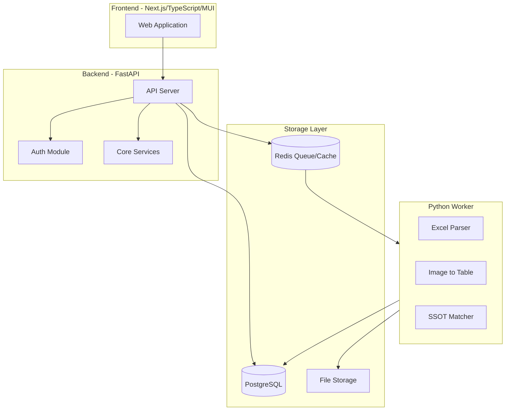
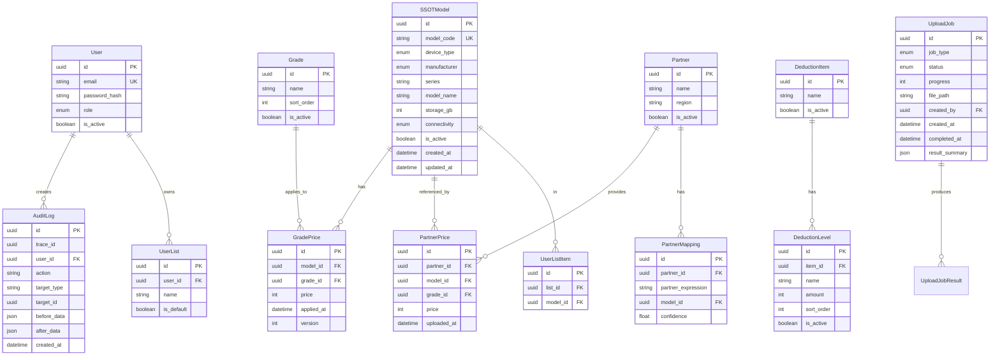
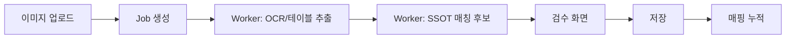

# 단가표 통합 관리 시스템 개발 계획

## 시스템 개요

본사 판매 단가표를 SSOT(단일 기준 모델) 기반으로 웹에서 통합 관리하고, 거래처별 단가표를 업로드(이미지/엑셀)하여 동일 모델 기준으로 가격을 비교하는 관리자 시스템입니다.




---

## 기술 스택 (확정)

| 레이어 | 기술 | 역할 |

|--------|------|------|

| Frontend | Next.js 14 + TypeScript + MUI v5 | Admin/Viewer UI |

| Backend | FastAPI (Python 3.11+) | REST API + Upload Orchestrator |

| Database | PostgreSQL 15 | SSOT/가격/권한/감사로그/Job 상태 |

| Queue/Cache | Redis 7 | Job Queue + Read Cache |

| Worker | Python Worker (RQ) | 엑셀 파싱, 이미지→테이블, 매칭 |

| 배포 | Docker Compose | 단일 서버 운영 |

---

## 개발 원칙

1. **Vertical Slice 개발**: 화면이 아니라 업무 흐름 단위로 끝까지 완성
2. **SSOT 무결성**: 자동 생성 금지, 삭제 대신 비활성화 중심 운영
3. **MUI Theme 기반**: 임의 스타일 하드코딩 금지, Theme 토큰만 사용
4. **Job 비동기 처리**: 업로드는 job_id 기반 비동기, 5초 폴링
5. **감사로그 필수**: 모든 변경은 누가/언제/무엇을/어떻게 + 전/후 기록

---

## 프로젝트 구조

```
dwt-price-center/
├── docker-compose.yml
├── frontend/                    # Next.js App
│   ├── src/
│   │   ├── app/                 # App Router
│   │   ├── components/          # 공통 컴포넌트
│   │   │   ├── layout/          # AppLayout, PageHeader
│   │   │   ├── ui/              # Buttons, Dialogs, Toast
│   │   │   ├── data/            # DataTable, ReviewPanel
│   │   │   └── upload/          # UploadDropzone, JobStatusBanner
│   │   ├── features/            # 도메인별 모듈
│   │   │   ├── auth/
│   │   │   ├── ssot-models/
│   │   │   ├── grades/
│   │   │   ├── deductions/
│   │   │   ├── hq-prices/
│   │   │   ├── partners/
│   │   │   ├── partner-prices/
│   │   │   ├── compare/
│   │   │   ├── my-lists/
│   │   │   ├── audit/
│   │   │   └── users/
│   │   ├── lib/                 # API 클라이언트, 유틸
│   │   └── theme/               # MUI Theme 설정
│   └── package.json
├── backend/                     # FastAPI App
│   ├── app/
│   │   ├── api/                 # 라우터
│   │   ├── core/                # Config, Security, DB
│   │   ├── models/              # SQLAlchemy Models
│   │   ├── schemas/             # Pydantic Schemas
│   │   ├── services/            # 비즈니스 로직
│   │   └── main.py
│   ├── alembic/                 # DB 마이그레이션
│   └── requirements.txt
├── worker/                      # Python Worker
│   ├── tasks/
│   │   ├── excel_parser.py
│   │   ├── image_to_table.py
│   │   └── ssot_matcher.py
│   └── requirements.txt
└── README.md
```

---

## 데이터 모델 (핵심)




---

## 개발 단계 (Vertical Slice)

### Phase 0: 프로젝트 초기화 및 인프라 구축

- Docker Compose 환경 구성 (PostgreSQL, Redis, Next.js, FastAPI, Worker)
- Next.js + MUI Theme 설정 및 공통 컴포넌트 구축
- FastAPI 프로젝트 구조 및 DB 연결
- JWT 기반 인증 시스템
- 감사로그 기반 인프라

### Phase 1: SSOT 모델 관리 (Slice 1)

**목표**: 모델 등록/편집/숨김 + 등급별 기본가 관리 + 감사로그

- SSOT 모델 CRUD (타입/제조사/시리즈/모델명/스토리지/모델코드)
- 분류 구조: 스마트폰/태블릿/웨어러블 > 애플/삼성/기타
- 등급 관리 (추가/정렬/비활성화, 삭제 금지)
- 등급별 기본가 관리 (모델 상세에서 편집)
- 감사로그 기록 (모델/등급/가격 변경 전/후)

### Phase 2: 차감 관리

**목표**: 정액 차감 항목/레벨/금액 관리

- 차감 항목 CRUD (비활성화 중심)
- 레벨별 금액 관리
- 치환 후 제거 정책 구현
- 감사로그 연동

### Phase 3: 본사 단가표 운영 (Slice 2)

**목표**: 엑셀 업로드 → 모델코드 매핑 → 검수 → 확정 → 적용


- 엑셀 업로드 API (job_id 즉시 반환)
- Worker: 엑셀 파싱 + 모델코드 기반 자동 매핑
- 미매핑 처리 (제외/보류/SSOT 등록 후 재업로드)
- 검수 화면 (2단 레이아웃: 원본 vs 매핑 결과)
- 확정/적용 분리 (Apply Lock 구현)
- 감사로그 (업로드/검수/확정/적용)

### Phase 4: 거래처 관리 및 단가표 운영 (Slice 3)

**목표**: 거래처 등록 + 이미지/엑셀 업로드 → 테이블 변환 → SSOT 매칭 → 검수 → 저장




- 거래처 CRUD
- 이미지 업로드 + OCR/테이블 변환 (Worker)
- 엑셀 업로드 + 자동 매핑
- SSOT 매칭 후보 생성 (신뢰도 포함)
- 검수 화면 (저신뢰 항목 강조)
- 매핑 누적 (거래처 표기 → 모델코드)
- 품질 경고 (흐림/잘림/해상도 부족)

### Phase 5: 공통 화면 - 본사 단가 리스트 및 비교 (Slice 4)

**목표**: Viewer/Admin 공통 조회 + 거래처별 가격 비교

- 본사 판매 단가 리스트 (최종 업데이트 일시, 검색/필터, 등급 선택)
- 업체별 단가 비교 (모델 x 거래처 테이블, 최고/최저 하이라이트)
- 선택 모델 비교 (관리자 지정 리스트 기반)
- 모델 단일 비교 (상세)
- 내 리스트로 비교 (개인화)
- 즐겨찾기/내 리스트 관리

### Phase 6: 사용자 관리 및 고도화 (Slice 5)

**목표**: 계정 관리 + 감사로그 UX + 전체 고도화

- 사용자 계정 생성/비활성화
- 역할 부여 (Admin/Viewer)
- 감사로그 조회 (기간/사용자/메뉴/작업유형 필터)
- trace_id 기반 작업 묶음 조회
- 변경 전/후 상세 비교 뷰

---

## 주요 API 엔드포인트

| 모듈 | 엔드포인트 | 설명 |

|------|-----------|------|

| Auth | POST /api/auth/login | 로그인 |

| Auth | POST /api/auth/logout | 로그아웃 |

| SSOT | GET/POST /api/ssot-models | 모델 목록/생성 |

| SSOT | GET/PUT/PATCH /api/ssot-models/{id} | 모델 상세/수정/비활성화 |

| Grades | GET/POST /api/grades | 등급 목록/생성 |

| Deductions | GET/POST /api/deductions | 차감 항목 관리 |

| HQ Prices | GET /api/hq-prices | 본사 단가 조회 |

| HQ Prices | POST /api/hq-prices/upload | 본사 엑셀 업로드 |

| Partners | GET/POST /api/partners | 거래처 목록/생성 |

| Partner Prices | POST /api/partner-prices/upload | 거래처 단가 업로드 |

| Jobs | GET /api/jobs/{job_id} | Job 상태 조회 |

| Compare | GET /api/compare | 비교 데이터 조회 |

| My Lists | GET/POST /api/my-lists | 개인 리스트 관리 |

| Audit | GET /api/audit-logs | 감사로그 조회 |

| Users | GET/POST /api/users | 사용자 관리 |

---

## 공통 컴포넌트 (MUI 기반)

| 컴포넌트 | 용도 |

|----------|------|

| `AppLayout` | 사이드바/상단바/컨텐츠 레이아웃 |

| `PageHeader` | 제목/설명/CTA/상태 표시 |

| `PrimaryButton` | 핵심 CTA (등록/저장/확정/적용) |

| `ConfirmDialog` | 확정/적용/숨김 확인 |

| `Toast/Snackbar` | 성공/실패/경고 알림 |

| `DataTable` | MUI DataGrid 기반 리스트/비교 |

| `UploadDropzone` | 파일 선택/유효성/진행 상태 |

| `JobStatusBanner` | queued/running/succeeded/failed 표시 |

| `ReviewPanel` | 검수 화면 (후보/수정/확정) |

---

## 실행 순서 요약

1. **Phase 0**: 프로젝트 초기화 + Docker 환경 + MUI Theme + 인증
2. **Phase 1**: SSOT 모델 + 등급 + 등급별 가격 + 감사로그
3. **Phase 2**: 차감 항목/레벨/금액 관리
4. **Phase 3**: 본사 엑셀 업로드 플로우 (Worker + 검수 + 확정/적용)
5. **Phase 4**: 거래처 관리 + 이미지/엑셀 업로드 (OCR + 매칭)
6. **Phase 5**: 공통 화면 (본사 단가 리스트 + 거래처 비교 + 내 리스트)
7. **Phase 6**: 사용자 관리 + 감사로그 고도화

---

## DoD (Definition of Done) 체크리스트

각 기능은 아래를 모두 만족해야 완료:

- 권한 체크 (Admin/Viewer)
- 감사로그 기록 (변경 전/후)
- 실패/예외 처리 (사용자 메시지 포함)
- 핵심 로직 최소 테스트 1개
- UI 일관성 (MUI 공통 컴포넌트/토큰 사용)

