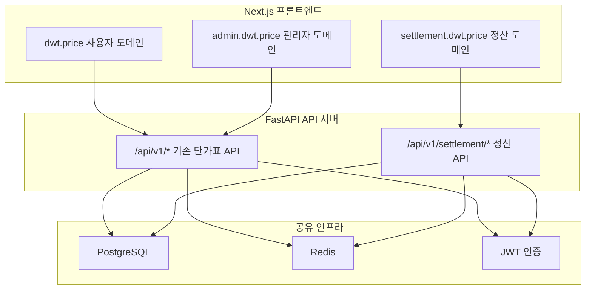
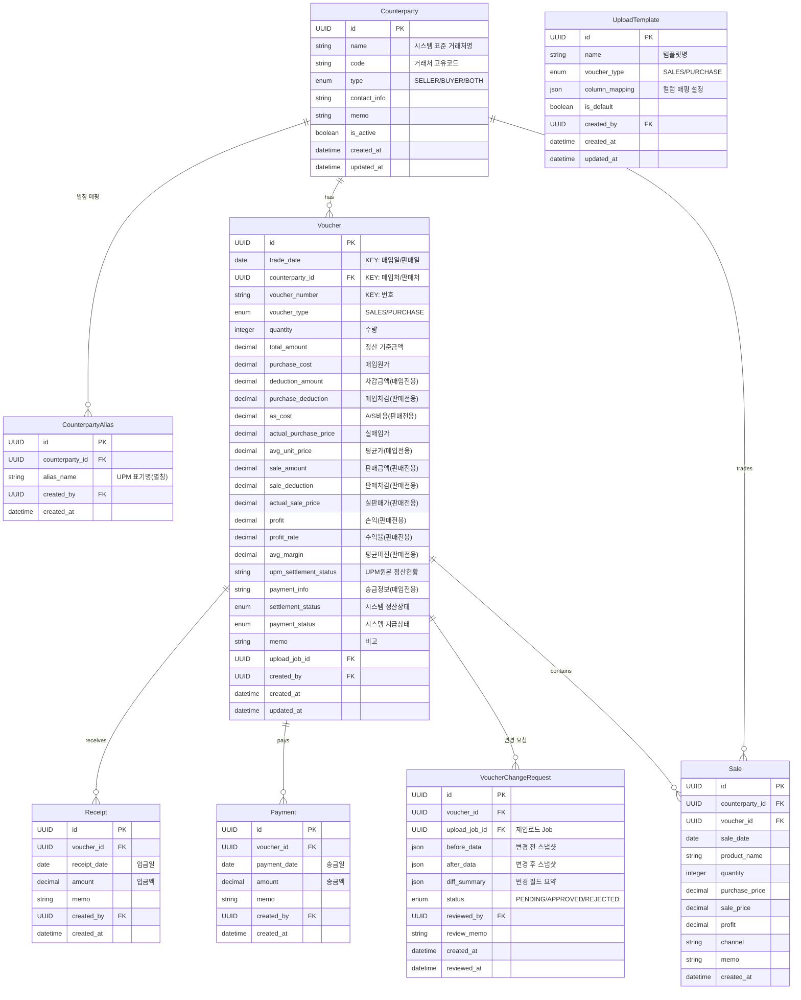
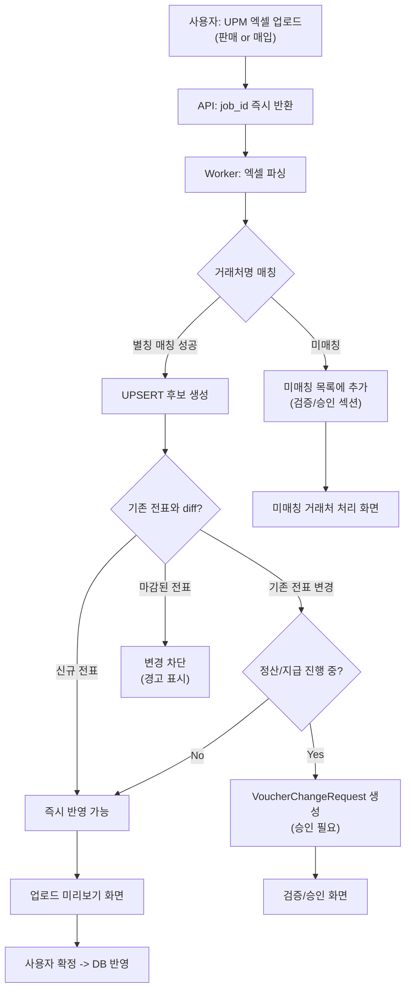

# 정산/미수/미지급/전표 통합 관리 시스템 -- 통합 계획 v2

## 아키텍처 전략: 도메인 기반 논리적 분리

기존 `admin.dwt.price` / `dwt.price` 패턴을 활용하여 **`settlement.dwt.price`** 도메인을 추가한다.
같은 FastAPI + Next.js 프로세스 내에서 새 도메인 모듈을 분리하되, 인증/DB/Redis/Docker 인프라를 공유한다.



---

## 1. 새 역할(Role) 추가

[`backend/app/models/enums.py`](backend/app/models/enums.py)의 `UserRole`에 새 역할 추가:

- `SETTLEMENT = "settlement"` -- 경영지원본부(정산 관리 전용)

프론트엔드 미들웨어([`frontend/src/middleware.ts`](frontend/src/middleware.ts))에서 `settlement.dwt.price` 도메인 접근 시 `settlement` 또는 `admin` 역할만 허용하도록 분기 추가.
기존 `admin.dwt.price` 도메인의 메뉴/접근에는 영향 없음.

---

## 2. 사이드바 메뉴 구조 (사용자 행동 중심)

> 핵심: 사용자의 동선은 "업로드 → 검증 → 정산 확인 → 마감"이다.
> 업로드(UPM)를 대시보드 바로 아래에 배치하여, 가장 빈번한 작업에 최단 동선을 제공한다.

```
settlement.dwt.price 사이드바
------------------------------
대시보드
  정산 요약(미수/미지급/정산중/마감현황)

업로드(UPM)                          ← 대시보드 바로 아래 (최빈 작업)
  판매 전표 업로드(UPM)
  매입 전표 업로드(UPM)
  업로드 작업 내역(Job)
  업로드 템플릿/매핑 관리

전표 원장(UPM)
  전표 목록
  전표 상세(입금/송금/이력)           ← 목록에서 drill-down

검증/승인                             ← 업로드와 분리 (입력 vs 통제)
  변경 감지/승인(전표 변경)
  미매칭 거래처 처리(별칭 매핑)

정산 현황
  미수 현황(Receivables)
  미지급 현황(Payables)

거래처
  거래처 목록/수정
  거래처 요약(미수/미지급/거래 추이)  ← 목록에서 drill-down

마감(LOCK)                            ← 전용 메뉴 (월말/분기 일괄 처리)
  전표 마감 관리
  마감 내역/감사 로그(조회)
```

### 메뉴 설계 원칙

1. **업로드 = "입력", 검증/승인 = "통제"**: 업로드 화면에서 "그냥 반영"을 막고, 위험 변경은 승인 구간을 거치도록 물리적으로 분리
2. **미매칭 거래처 처리는 검증 섹션**: 업로드 성공률을 결정하는 핵심 작업이므로, 승인/검증 섹션에 배치하여 담당자가 바로 해결 가능
3. **마감(LOCK)은 독립 메뉴**: 전표 상세 버튼만으로 부족 -- 월말 일괄 마감/마감 전표 조회/감사 추적이 반드시 필요
4. **Sale 분석은 Phase 7(선택)**: UPM 판매/매입 전표와 혼동 방지, 손익/채널 분석이 실제로 필요할 때만 "분석" 섹션으로 추가

---

## 3. UPM 엑셀 원본 컬럼 분석

### 3.1 UPM 매입 전표 (Purchase Voucher)

| UPM 컬럼 | DB 필드명 | 타입 | 키/수식 |
|---|---|---|---|
| 선택 | (skip) | - | UI 체크박스, 파싱 제외 |
| **매입일** | `trade_date` | DATE | **UNIQUE KEY 1** |
| **매입처** | → `counterparty_id` | FK | **UNIQUE KEY 2** (별칭 매칭) |
| **번호** | `voucher_number` | STRING | **UNIQUE KEY 3** |
| 수량 | `quantity` | INTEGER | |
| 매입원가 | `purchase_cost` | DECIMAL | 차감 전 원가 |
| 차감금액 | `deduction_amount` | DECIMAL | |
| 실매입가 | `actual_purchase_price` | DECIMAL | = 매입원가 - 차감금액 |
| 평균가 | `avg_unit_price` | DECIMAL | = 실매입가 / 수량 |
| 정산현황 | `upm_settlement_status` | STRING | UPM 원본값 (검수대기/정산완료 등) |
| 송금정보 | `payment_info` | STRING | |
| 비고 | `memo` | TEXT | |

> 정산 기준 금액(`total_amount`) = **실매입가** (우리가 매입처에 지급해야 할 금액)

### 3.2 UPM 판매 전표 (Sales Voucher)

| UPM 컬럼 | DB 필드명 | 타입 | 키/수식 |
|---|---|---|---|
| 선택 | (skip) | - | UI 체크박스, 파싱 제외 |
| **판매일** | `trade_date` | DATE | **UNIQUE KEY 1** |
| **판매처** | → `counterparty_id` | FK | **UNIQUE KEY 2** (별칭 매칭) |
| **번호** | `voucher_number` | STRING | **UNIQUE KEY 3** |
| 수량 | `quantity` | INTEGER | |
| 매입원가 | `purchase_cost` | DECIMAL | 원가(COGS) |
| 매입차감 | `purchase_deduction` | DECIMAL | |
| A/S비용 | `as_cost` | DECIMAL | |
| 실매입가 | `actual_purchase_price` | DECIMAL | = 매입원가 + 매입차감 + A/S비용 |
| 판매금액 | `sale_amount` | DECIMAL | 차감 전 매출 |
| 판매차감 | `sale_deduction` | DECIMAL | |
| 실판매가 | `actual_sale_price` | DECIMAL | = 판매금액 + 판매차감 |
| 손익 | `profit` | DECIMAL | = 실판매가 - 실매입가 |
| 수익율 | `profit_rate` | DECIMAL(5,2) | = 손익 / 실매입가 * 100 |
| 평균마진 | `avg_margin` | DECIMAL | = 손익 / 수량 |
| 비고 | `memo` | TEXT | |

> 정산 기준 금액(`total_amount`) = **실판매가** (판매처로부터 받아야 할 금액)

### 3.3 수식 검증 (실제 데이터 기준)

```
[매입 예시] 아이즈비전(라이크와이즈), 번호 49
  실매입가 = 25,693,000 - 0 = 25,693,000 ✓
  평균가   = 25,693,000 / 100 = 256,930 ✓
  total_amount = 25,693,000 (우리가 지급할 금액)

[판매 예시] STK-PK, 번호 30
  실매입가 = 45,033,000 + 6,073,000 + 0 = 51,106,000 ✓
  실판매가 = 54,869,500 + (-590,000) = 54,279,500 ✓
  손익     = 54,279,500 - 51,106,000 = 3,173,500 ✓
  수익율   = 3,173,500 / 51,106,000 × 100 = 6.21 ✓
  평균마진 = 3,173,500 / 127 = 24,988 ✓
  total_amount = 54,279,500 (우리가 받을 금액)
```

---

## 4. 데이터 모델 (새 테이블 8개)

모든 모델은 기존 [`backend/app/core/database.py`](backend/app/core/database.py)의 `Base`를 상속하고, Alembic 마이그레이션으로 관리.
Voucher는 매입/판매를 **단일 테이블**로 관리한다 (STI 패턴). 이유: 미수/미지급 집계, Receipt/Payment 연결, 대시보드 등에서 전표 타입과 무관하게 조회하는 경우가 많으므로 단일 테이블이 쿼리 효율이 높다.



### 4.1 Voucher 컬럼 상세 (매입/판매 공통 + 전용)

| 컬럼 | 매입 전표 | 판매 전표 | 설명 |
|---|:---:|:---:|---|
| `trade_date` | **KEY** | **KEY** | 매입일 / 판매일 |
| `counterparty_id` | **KEY** | **KEY** | 매입처 / 판매처 (별칭 매칭) |
| `voucher_number` | **KEY** | **KEY** | UPM 번호 |
| `voucher_type` | PURCHASE | SALES | 전표 타입 |
| `quantity` | O | O | 수량 |
| `total_amount` | O | O | **정산 기준 금액** (매입:실매입가, 판매:실판매가) |
| `purchase_cost` | O | O | 매입원가 |
| `deduction_amount` | O | - | 차감금액 (매입 전용) |
| `purchase_deduction` | - | O | 매입차감 (판매 전용) |
| `as_cost` | - | O | A/S비용 (판매 전용) |
| `actual_purchase_price` | O | O | 실매입가 |
| `avg_unit_price` | O | - | 평균가 (매입 전용) |
| `sale_amount` | - | O | 판매금액 (판매 전용) |
| `sale_deduction` | - | O | 판매차감 (판매 전용) |
| `actual_sale_price` | - | O | 실판매가 (판매 전용) |
| `profit` | - | O | 손익 (판매 전용) |
| `profit_rate` | - | O | 수익율 % (판매 전용) |
| `avg_margin` | - | O | 평균마진 (판매 전용) |
| `upm_settlement_status` | O | - | UPM 원본 정산현황 |
| `payment_info` | O | - | 송금정보 |
| `settlement_status` | O | O | **시스템** 정산 상태 |
| `payment_status` | O | O | **시스템** 지급 상태 |
| `memo` | O | O | 비고 |

### 4.2 total_amount 결정 로직

```python
# Worker에서 엑셀 파싱 시 total_amount 자동 결정
if voucher_type == PURCHASE:
    total_amount = actual_purchase_price   # 실매입가 = 우리가 지급할 금액
elif voucher_type == SALES:
    total_amount = actual_sale_price       # 실판매가 = 우리가 받을 금액
```

### 4.3 기본 업로드 템플릿 (UploadTemplate 초기 데이터)

**매입 전표 기본 템플릿:**
```json
{
  "name": "UPM 매입 기본",
  "voucher_type": "PURCHASE",
  "column_mapping": {
    "trade_date": "매입일",
    "counterparty_name": "매입처",
    "voucher_number": "번호",
    "quantity": "수량",
    "purchase_cost": "매입원가",
    "deduction_amount": "차감금액",
    "actual_purchase_price": "실매입가",
    "avg_unit_price": "평균가",
    "upm_settlement_status": "정산현황",
    "payment_info": "송금정보",
    "memo": "비고"
  },
  "skip_columns": ["선택"]
}
```

**판매 전표 기본 템플릿:**
```json
{
  "name": "UPM 판매 기본",
  "voucher_type": "SALES",
  "column_mapping": {
    "trade_date": "판매일",
    "counterparty_name": "판매처",
    "voucher_number": "번호",
    "quantity": "수량",
    "purchase_cost": "매입원가",
    "purchase_deduction": "매입차감",
    "as_cost": "A/S비용",
    "actual_purchase_price": "실매입가",
    "sale_amount": "판매금액",
    "sale_deduction": "판매차감",
    "actual_sale_price": "실판매가",
    "profit": "손익",
    "profit_rate": "수익율",
    "avg_margin": "평균마진",
    "memo": "비고"
  },
  "skip_columns": ["선택"]
}
```

### 4.4 Unique Key 정의

```
UNIQUE(counterparty_id, trade_date, voucher_number)
```

- `counterparty_id`: UPM의 "매입처" 또는 "판매처"를 CounterpartyAlias로 매칭한 결과
- `trade_date`: UPM의 "매입일" 또는 "판매일"
- `voucher_number`: UPM의 "번호" (string으로 저장, 정수가 아닐 수 있음)

> 동일 키로 재업로드 시 UPSERT: 신규면 INSERT, 기존이면 변경 감지 후 UPDATE(또는 승인 대기)

### 4.5 핵심 설계 원칙

- **Voucher 유니크 키**: `(counterparty_id, trade_date, voucher_number)` 조합으로 DB Unique 제약
- **잔액 자동 계산**: 서버 단일 로직에서 수행
  - 미수(Receivable) = `voucher.total_amount - SUM(receipts.amount)` (판매 전표)
  - 미지급(Payable) = `voucher.total_amount - SUM(payments.amount)` (매입 전표)
- **상태 자동 판정**: Receipt/Payment 누적에 따라 settlement_status/payment_status 서버에서 자동 전이
- **UPSERT**: 유니크 키 기준 UPSERT로 SSOT 유지
- **UPM 원본 보존**: UPM의 모든 수치 컬럼을 원본 그대로 저장 (재계산하지 않음)
- **total_amount는 파싱 시 결정**: 매입=실매입가, 판매=실판매가로 자동 세팅
- **UPM 정산현황 vs 시스템 정산상태**: UPM 원본값(`upm_settlement_status`)과 시스템 관리값(`settlement_status`)을 분리 저장
- **변경 감지**: 재업로드 시 기존 전표와 diff -> VoucherChangeRequest 생성 -> 승인 후 반영
- **별칭 매핑**: CounterpartyAlias가 누적되면 업로드 자동 매칭률 상승
- **감사 로그**: 기존 [`AuditLog`](backend/app/models/audit_log.py) 모델 재사용 + 새 AuditAction enum 값 추가

### 4.6 파일 구조 (새로 생성할 파일)

```
backend/app/models/
  counterparty.py          # Counterparty + CounterpartyAlias 모델
  voucher.py               # Voucher 모델 (매입/판매 통합, STI 패턴)
  receipt.py               # Receipt 모델
  payment.py               # Payment 모델
  voucher_change.py        # VoucherChangeRequest 모델
  upload_template.py       # UploadTemplate 모델
  sale.py                  # Sale 모델 (Phase 7)

backend/app/schemas/
  settlement/
    __init__.py
    counterparty.py        # 거래처 관련 Pydantic 스키마
    voucher.py             # 전표 관련 Pydantic 스키마 (매입/판매 공통 + 전용)
    receipt.py             # 입금 관련 스키마
    payment.py             # 송금 관련 스키마
    upload.py              # 업로드/Job 관련 스키마
    verification.py        # 변경 감지/승인 스키마
    dashboard.py           # 대시보드 집계 스키마

backend/app/api/v1/settlement/
  __init__.py
  router.py                # 정산 도메인 통합 라우터
  counterparties.py        # 거래처 CRUD + 별칭 관리
  vouchers.py              # 전표 CRUD + UPSERT
  receipts.py              # 입금 이력 CRUD
  payments.py              # 송금 이력 CRUD
  upload.py                # UPM 판매/매입 엑셀 업로드 (분리 엔드포인트)
  templates.py             # 업로드 템플릿/매핑 관리
  verification.py          # 변경 감지/승인 + 미매칭 거래처 처리
  dashboard.py             # 대시보드/리포트
  lock.py                  # 마감 관리
  sales.py                 # 판매 분석 데이터 (Phase 7)

worker/tasks/
  voucher_parser.py        # UPM 전표 엑셀 파싱 (매입/판매 분기 처리)
                           # - column_mapping 기반 동적 컬럼 매핑
                           # - CounterpartyAlias 매칭
                           # - UPSERT + diff 비교
                           # - total_amount 자동 결정
```

---

## 5. Enum 확장

[`backend/app/models/enums.py`](backend/app/models/enums.py)에 추가:

```python
# 역할
class UserRole(str, enum.Enum):
    ADMIN = "admin"
    VIEWER = "viewer"
    SETTLEMENT = "settlement"   # 신규: 경영지원본부

# 거래처 타입
class CounterpartyType(str, enum.Enum):
    SELLER = "seller"       # 판매처
    BUYER = "buyer"         # 매입처
    BOTH = "both"           # 양쪽 역할

# 전표 타입
class VoucherType(str, enum.Enum):
    SALES = "sales"         # 판매 전표
    PURCHASE = "purchase"   # 매입 전표

# 정산 상태 (입금 관점)
class SettlementStatus(str, enum.Enum):
    OPEN = "open"           # 미정산
    SETTLING = "settling"   # 정산중(부분정산)
    SETTLED = "settled"     # 정산완료
    LOCKED = "locked"       # 마감

# 지급 상태 (송금 관점)
class PaymentStatus(str, enum.Enum):
    UNPAID = "unpaid"       # 미지급
    PARTIAL = "partial"     # 부분지급
    PAID = "paid"           # 지급완료
    LOCKED = "locked"       # 마감

# 변경 요청 상태
class ChangeRequestStatus(str, enum.Enum):
    PENDING = "pending"     # 대기
    APPROVED = "approved"   # 승인
    REJECTED = "rejected"   # 거부

# 기존 JobType에 추가
class JobType(str, enum.Enum):
    # ... 기존 값 유지 ...
    VOUCHER_SALES_EXCEL = "voucher_sales_excel"       # UPM 판매 전표 업로드
    VOUCHER_PURCHASE_EXCEL = "voucher_purchase_excel"  # UPM 매입 전표 업로드
```

AuditAction에 정산 관련 액션 추가:
- `VOUCHER_CREATE`, `VOUCHER_UPDATE`, `VOUCHER_UPSERT`, `VOUCHER_LOCK`, `VOUCHER_UNLOCK`
- `RECEIPT_CREATE`, `RECEIPT_DELETE`
- `PAYMENT_CREATE`, `PAYMENT_DELETE`
- `COUNTERPARTY_CREATE`, `COUNTERPARTY_UPDATE`, `COUNTERPARTY_ALIAS_CREATE`, `COUNTERPARTY_ALIAS_DELETE`
- `VOUCHER_CHANGE_DETECTED`, `VOUCHER_CHANGE_APPROVED`, `VOUCHER_CHANGE_REJECTED`
- `UPLOAD_TEMPLATE_CREATE`, `UPLOAD_TEMPLATE_UPDATE`
- `VOUCHER_BATCH_LOCK`, `VOUCHER_BATCH_UNLOCK`

---

## 6. API 엔드포인트 (새 라우터)

기존 [`backend/app/api/v1/router.py`](backend/app/api/v1/router.py)에 정산 라우터 추가:

```python
api_router.include_router(settlement_router, prefix="/settlement", tags=["정산"])
```

### 전체 API 목록

| 섹션 | 엔드포인트 | 설명 |
|---|---|---|
| **대시보드** | `GET /settlement/dashboard/summary` | 정산 요약(미수/미지급/정산중/마감) |
| | `GET /settlement/dashboard/top-receivables` | 미수 상위 N |
| | `GET /settlement/dashboard/top-payables` | 미지급 상위 N |
| **업로드(UPM)** | `POST /settlement/upload/sales` | UPM 판매 전표 엑셀 업로드 |
| | `POST /settlement/upload/purchase` | UPM 매입 전표 엑셀 업로드 |
| | `GET /settlement/upload/jobs` | 업로드 작업 내역 |
| | `GET /settlement/upload/jobs/{id}` | 업로드 작업 상세(미리보기/diff) |
| | `POST /settlement/upload/jobs/{id}/confirm` | 업로드 확정 반영 |
| **템플릿** | `GET/POST/PATCH /settlement/upload/templates` | 업로드 템플릿/매핑 관리 |
| **전표 원장** | `GET /settlement/vouchers` | 전표 목록(필터/검색/페이징) |
| | `GET /settlement/vouchers/{id}` | 전표 상세(잔액/이력 포함) |
| | `POST /settlement/vouchers` | 전표 수동 생성 |
| | `PATCH /settlement/vouchers/{id}` | 전표 수정 |
| **입금 이력** | `POST /settlement/vouchers/{id}/receipts` | 입금 기록 추가 |
| | `DELETE /settlement/vouchers/{id}/receipts/{rid}` | 입금 기록 삭제 |
| **송금 이력** | `POST /settlement/vouchers/{id}/payments` | 송금 기록 추가 |
| | `DELETE /settlement/vouchers/{id}/payments/{pid}` | 송금 기록 삭제 |
| **검증/승인** | `GET /settlement/verification/changes` | 변경 감지 목록(PENDING) |
| | `POST /settlement/verification/changes/{id}/approve` | 변경 승인 |
| | `POST /settlement/verification/changes/{id}/reject` | 변경 거부 |
| | `GET /settlement/verification/unmatched` | 미매칭 거래처 목록 |
| | `POST /settlement/verification/unmatched/{id}/map` | 별칭 매핑 연결 |
| **정산 현황** | `GET /settlement/receivables` | 미수 현황(거래처별/기간별) |
| | `GET /settlement/payables` | 미지급 현황(거래처별/기간별) |
| **거래처** | `GET/POST/PATCH /settlement/counterparties` | 거래처 CRUD |
| | `GET /settlement/counterparties/{id}/summary` | 거래처 요약(미수/미지급/추이) |
| | `GET/POST/DELETE /settlement/counterparties/{id}/aliases` | 별칭 관리 |
| **마감** | `POST /settlement/lock/batch` | 전표 일괄 마감 |
| | `POST /settlement/lock/unlock/{id}` | 마감 해제(관리자) |
| | `GET /settlement/lock/history` | 마감 내역/감사 로그 |

---

## 7. 프론트엔드 라우트 구조

기존 도메인 분리 패턴([`frontend/src/components/layout/AppLayout.tsx`](frontend/src/components/layout/AppLayout.tsx))을 확장하여 `settlement.dwt.price` 도메인 메뉴 추가.

```
frontend/src/app/(main)/settlement/
  dashboard/page.tsx                          # 대시보드 (정산 요약)

  # 업로드(UPM) - 대시보드 바로 아래 배치
  upload/sales/page.tsx                       # UPM 판매 전표 업로드
  upload/purchase/page.tsx                    # UPM 매입 전표 업로드
  upload/jobs/page.tsx                        # 업로드 작업 내역(Job 목록)
  upload/jobs/[id]/page.tsx                   # 업로드 작업 상세(미리보기/diff/확정)
  upload/templates/page.tsx                   # 업로드 템플릿/매핑 관리

  # 전표 원장(UPM)
  vouchers/page.tsx                           # 전표 목록
  vouchers/[id]/page.tsx                      # 전표 상세(입금/송금/이력)

  # 검증/승인
  verification/changes/page.tsx               # 변경 감지/승인
  verification/unmatched/page.tsx             # 미매칭 거래처 처리(별칭 매핑)

  # 정산 현황
  receivables/page.tsx                        # 미수 현황(Receivables)
  payables/page.tsx                           # 미지급 현황(Payables)

  # 거래처
  counterparties/page.tsx                     # 거래처 목록/수정
  counterparties/[id]/page.tsx                # 거래처 요약(미수/미지급/거래 추이)

  # 마감(LOCK)
  lock/page.tsx                               # 전표 마감 관리
  lock/history/page.tsx                       # 마감 내역/감사 로그
```

---

## 8. 설정/인프라 변경

- [`backend/app/core/config.py`](backend/app/core/config.py): `SETTLEMENT_DOMAIN` 환경 변수 추가
- [`docker-compose.yml`](docker-compose.yml): `SETTLEMENT_DOMAIN` 환경변수 추가 (새 컨테이너 불필요)
- [`frontend/src/lib/domain.ts`](frontend/src/lib/domain.ts): `settlement` 도메인 타입 추가
- [`frontend/src/lib/store.ts`](frontend/src/lib/store.ts): 도메인 스토어에 `isSettlementDomain` 추가
- [`frontend/src/lib/api.ts`](frontend/src/lib/api.ts): 정산 API 함수 추가 (`settlementApi`)
- [`frontend/src/middleware.ts`](frontend/src/middleware.ts): settlement 도메인 접근 권한 체크 추가

---

## 9. 업로드 처리 플로우 (핵심 비즈니스 로직)

사용자의 핵심 행동은 "판매 올릴래 / 매입 올릴래" 2가지로 수렴한다.



### 엑셀 파싱 상세 플로우

```
1. 엑셀 시트 읽기 → UploadTemplate의 column_mapping으로 컬럼 식별
2. 행별 처리:
   a. "선택" 컬럼 스킵
   b. "매입처"/"판매처" → CounterpartyAlias 테이블에서 검색
      - 매칭 성공 → counterparty_id 확정
      - 매칭 실패 → 미매칭 목록에 추가 (해당 행은 pending)
   c. 유니크 키 생성: (counterparty_id, trade_date, voucher_number)
   d. 기존 Voucher 조회:
      - 없음 → INSERT 후보 (신규)
      - 있음 → 기존 데이터와 diff 비교
   e. total_amount 결정:
      - 매입: actual_purchase_price (= 매입원가 - 차감금액)
      - 판매: actual_sale_price (= 판매금액 + 판매차감)
3. 미리보기 데이터 생성 → Job 상태 업데이트
4. 사용자 확정 시 → DB 반영 (UPSERT)
```

### 변경 감지 규칙 (안전 장치)

1. **신규 전표**: 바로 반영 가능 (미리보기 후 확정)
2. **기존 전표(OPEN 상태)**: 바로 덮어쓰기 가능 (미리보기 후 확정)
3. **기존 전표(SETTLING/PARTIAL 상태)**: VoucherChangeRequest 생성 → 관리자 승인 후 반영
4. **기존 전표(LOCKED 상태)**: 변경 차단, diff만 보여주고 경고

### diff 비교 대상 필드

| 전표 타입 | diff 비교 대상 |
|---|---|
| 매입 | quantity, purchase_cost, deduction_amount, actual_purchase_price, memo |
| 판매 | quantity, purchase_cost, purchase_deduction, as_cost, actual_purchase_price, sale_amount, sale_deduction, actual_sale_price, profit, memo |

> `upm_settlement_status`, `payment_info`는 UPM 원본 참고용이므로 diff 비교에서 제외 가능 (운영 판단)

---

## 10. 개발 단계 (7 Phase)

각 Phase는 "Vertical Slice" 방식으로 백엔드 + 프론트엔드를 함께 완성한다.

### Phase 1: 기반 구조 + 거래처 관리 (+ 별칭)

**목표**: settlement 도메인이 동작하고, 거래처를 등록/관리할 수 있는 상태

- 새 역할(`SETTLEMENT`) 추가 → Alembic 마이그레이션
- `settlement.dwt.price` 도메인 라우팅 설정 (미들웨어/도메인 감지)
- settlement 도메인 사이드바/레이아웃 구현 (AppLayout 확장)
- `Counterparty` + `CounterpartyAlias` 모델/API/화면
- 거래처 목록/수정 화면 + 별칭 관리 UI

### Phase 2: 전표 SSOT + UPM 업로드 (판매/매입 분리)

**목표**: UPM 엑셀을 올리면 전표가 DB에 UPSERT되고, 목록/상세에서 조회 가능한 상태

- `Voucher` 모델 + `UploadTemplate` 모델 → Alembic 마이그레이션
- `UploadJob`에 `VOUCHER_SALES_EXCEL` / `VOUCHER_PURCHASE_EXCEL` 타입 추가
- Worker: `voucher_parser.py` (엑셀 파싱 + 거래처 별칭 매칭 + UPSERT)
- 판매 전표 업로드 화면 / 매입 전표 업로드 화면 (UPM 명시)
- 업로드 미리보기 → 검증 → 확정 반영 플로우
- 업로드 작업 내역(Job) 화면
- 업로드 템플릿/매핑 관리 화면
- 전표 목록 화면 (필터: 전표타입/거래처/기간/상태)
- 전표 상세 화면 (기본 정보, 잔액 표시)

### Phase 3: 입금/송금 이력 + 잔액 자동 계산

**목표**: 전표별 다회 입금/송금을 기록하고, 잔액/상태가 자동으로 갱신되는 상태

- `Receipt` + `Payment` 모델 → Alembic 마이그레이션
- 전표 상세 화면에서 다회 입금/송금 입력 UI
- 누적 입금액/송금액/잔액 서버 자동 계산 로직
- 정산상태(settlement_status) / 지급상태(payment_status) 자동 전이 로직:
  - 누적 = 0 → OPEN/UNPAID
  - 0 < 누적 < 총금액 → SETTLING/PARTIAL
  - 누적 >= 총금액 → SETTLED/PAID
- 입금/송금 이력 타임라인 UI (전표 상세 내)

### Phase 4: 검증/승인 (변경 감지 + 미매칭 거래처)

**목표**: 재업로드 시 위험 변경을 자동 감지하고, 미매칭 거래처를 별칭으로 해결할 수 있는 상태

- `VoucherChangeRequest` 모델 → Alembic 마이그레이션
- Worker 변경: 재업로드 시 기존 전표와 diff 비교 → 조건별 분기(즉시/승인/차단)
- 변경 감지/승인 화면 (PENDING 목록 → 승인/거부)
- 미매칭 거래처 처리 화면:
  - 업로드에서 매칭 실패한 거래처명 목록
  - 기존 거래처에 별칭으로 연결 or 새 거래처 등록
  - 연결 후 해당 업로드 재처리 가능

### Phase 5: 미수/미지급 현황 + 거래처별 요약 + 대시보드

**목표**: 거래처별/기간별 미수/미지급을 5초 안에 확인 가능하고, 대시보드에 핵심 지표가 표시되는 상태

- 대시보드(정산 요약) 화면:
  - 미수 총액 / 미지급 총액 / 정산중 건수 / 마감 건수
  - Top N (미수 상위, 미지급 상위)
  - 기간 선택(일/주/월)
- 미수 현황 화면: 거래처별/기간별 판매 전표 잔액 집계
- 미지급 현황 화면: 거래처별/기간별 매입 전표 잔액 집계
- 거래처 요약 화면:
  - 해당 거래처의 매출/매입/미수/미지급 합계
  - 거래 추이 (월별 차트)

### Phase 6: 마감(LOCK) 전용 관리

**목표**: 월말/분기말에 전표를 일괄 마감하고, 마감 이력을 추적할 수 있는 상태

- 전표 마감 관리 화면:
  - 기간/거래처/상태 필터 → 마감 대상 선택
  - 일괄 마감(batch lock) 처리
  - 마감 시 변경 차단 (업로드 덮어쓰기 + 수동 수정 모두 차단)
  - 마감 해제(관리자 전용, 사유 입력 필수)
- 마감 내역/감사 로그 화면:
  - 누가/언제/어떤 전표를 마감했는지 조회
  - 기존 AuditLog 재사용
- 마감 상태 → settlement_status / payment_status에 LOCKED 반영

### Phase 7 (선택): 분석 -- Sale 데이터

**목표**: 판매처별 매출/손익/수익률/채널 분석이 필요한 경우에만 추가

- `Sale` 모델 → Alembic 마이그레이션
- 판매 데이터 엑셀 업로드
- 판매처별 매출/손익/수익률 대시보드
- 채널/품목별 분석
- 사이드바에 "분석(선택)" 섹션으로 추가

> Phase 7은 UPM 판매/매입 전표와 명확히 분리된다.
> 전표 = "돈이 오고 간 기록", Sale = "뭘 얼마에 팔았는지(품목/마진) 분석"